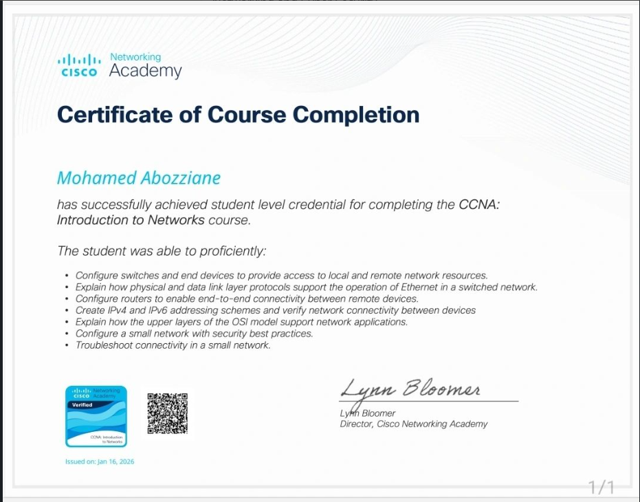
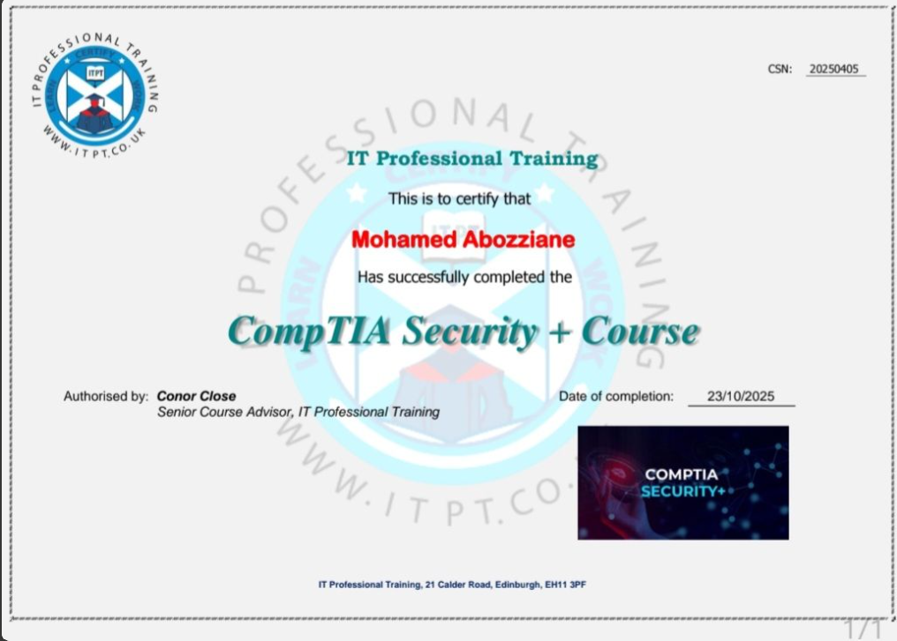

## Hi there 👋

# 👨‍💻 Mohamed Abozziane

### 🕵🏼‍♂️ SOC Analyst (In Training) | Security+ | CCNA

---

## 🚀 About Me

I am a cybersecurity student focused on becoming a **SOC Analyst (Tier 1)**.
I build hands-on labs to simulate real-world cyber attacks and practice detection, analysis, and incident response.

I have been acquiring hands-on experience through TryHackMe labs and practical projects, developing skills in :
- Threat detection
- Incident investigation
- Log analysis
- Cyber Attack lifecycle

🎓 HNC Cybersecurity – Edinburgh College
📜 CompTIA Security+ | Cisco CCNA

---

## 🔍 What I Do

* Investigate security alerts
* Analyze logs and suspicious activity
* Practice incident response scenarios
* Detect phishing and cyber threats

---

## 🎯 Career Objective
To obtain a position as a **Junior SOC Analyst** in which I will be able to:
- Monitor SIEM alerts
- Conduct security investigations
- Manage threats

---

## 💻 Skills & Knowledge
- SIEM Basics
- Log Analysis
- Cyber Kill Chain
- Threat Intelligence (basics)
- Incident Response (basics)
- Networking (CCNA level)

---

## 🧰 Tools (Learning)

- SIEMs (via TryHackMe labs)
- Wireshark (basics)
- Linux (basics)
- Windows Event Logs

---

## 📂 Featured Project

### 🔹 SOC Analyst Lab (TryHackMe)

Hands-on SOC training using TryHackMe labs
- Investigated simulated security incidents
- Analyzed logs and identified attack patterns
- Documented findings and response actions

➡️ https://github.com/safir-simo/soc-analyst-lab-tryhackme

### 🔹 SOC-Role-in-Blue-Team (TryHackMe)

- Understand the purpose of a Security Operations Centre (SOC)
- Learn the responsibilities of SOC analysts
- Understand Blue Team security operations
- Explore how security incidents are detected and managed

➡️ https://github.com/safir-simo/SOC-Role-in-Blue-Team/blob/main/README.md

### 🔹 SOC-Analyst-Lab-SIEM-Basics (TryHackMe)

- Understanding SIEM architecture and components
- Examining log sources and event types
- Performing log searches and filtration
- Reviewing alerts generated by the SIEM

➡️ https://github.com/safir-simo/SOC-Analyst-Lab-SIEM-Basics/blob/main/README.md

### 🔹Cyber Kill Chain – SOC Analysis Lab (TryHackMe)
 
- 7 Stages of the Cyber Kill Chain
- Applying This Model to Real SOC Incidents
- Structure of incident investigations

➡️ https://github.com/safir-simo/Cyber-Kill-Chain-SOC-Analysis-Lab/blob/main/README.md

### 🔹Ethical Hacking Lab – VAPT Assessment (HNC lab)

- Performed end to end VAPT assessment in controlled lab
- Identified and exploited real word vulnerabilities
- Documented findings with actionable security recommendations

➡️ https://github.com/safir-simo/Ethical-Hacking-Lab-VAPT-Assessment/blob/main/README.md     

---

## 🏆 Certifications

### 📜 Cisco CCNA

### 🔐 CompTIA Security+

---

## 📈 Current Goals

* Build a strong SOC Analyst portfolio
* Gain hands-on experience with SIEM tools
* Start a cybersecurity career in SOC

---

## 🧠 Currently Learning
- Log Analysis
- SIEM tools (Splunk / ELK)
- Threat Hunting
- Phishing analysis

---

## 📫 Contact

* LinkedIn: https://www.linkedin.com/in/mohamed-abozziane-b097042a4/
* Email: mohamedabozziane@protonmail.com

